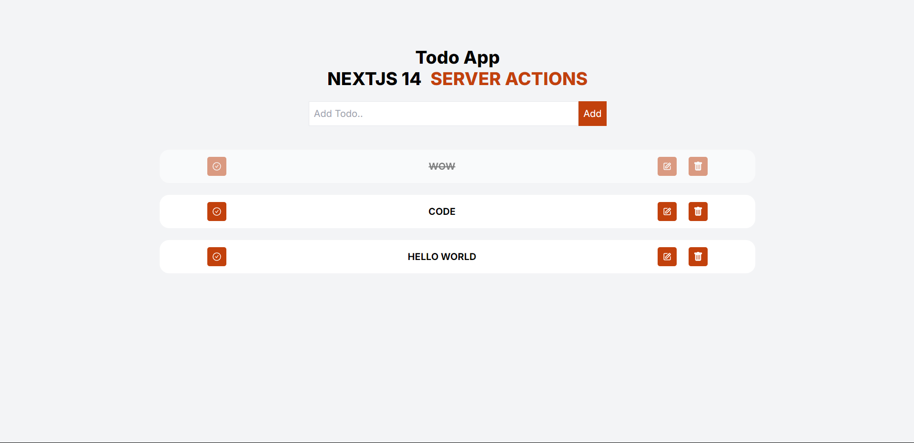

# Todo Application

Todo Application is a Full Stack Todo Management App built using Next.js, TypeScript, Prisma, and MongoDB. This application allows users to create, update, and delete tasks.

## Features

- **CRUD Operations**: Create, read, update, and delete tasks.
- **TypeScript**: Provides type safety and better code quality.
- **Database Integration**: Uses MongoDB for data storage with Prisma ORM.
- **Next.js App Router**: Utilizes the latest Next.js routing capabilities.

## Technologies Used

- **Frontend**: Next.js, TypeScript
- **Backend**: Prisma, MongoDB
- **Routing**: Next.js App Router

## Screenshots


## Getting Started

### Prerequisites

- Node.js (>= 16.x)
- MongoDB instance

### Installation

1. Clone the repository:
    ```sh
    git clone https://github.com/NamanSoni18/Todo-app-nextjs.git
    ```

2. Navigate to the project directory and install dependencies:
    ```sh
    cd todo-app-nextjs
    npm install
    ```

3. Create a `.env` file in the root directory and add your MongoDB URI:
    ```sh
    DATABASE_URL="your_db_url"
    ```

4. Run Prisma migrations to set up the database schema:
    ```sh
    npx prisma migrate dev
    ```

### Running the Application

1. Start the development server:
    ```sh
    npm run dev
    ```

2. Open your browser and navigate to:
    ```sh
    http://localhost:3000
    ```

## Contributing

Feel free to fork this repository and submit pull requests. For major changes, please open an issue first to discuss what you would like to change.